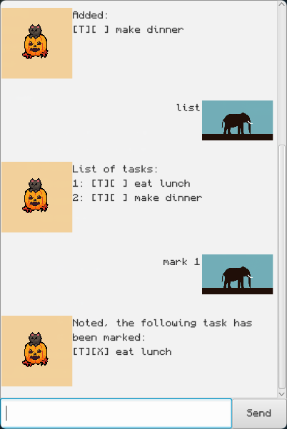

# Shadow User Guide

Shadow is a Command Line Interface (CLI) task manager that helps you organize your tasks efficiently. You can add deadlines, events, and todos, list all tasks, search, mark as done, unmark, and delete tasks—all from your terminal.



## Feature Summary

| Feature                | Command/Action         | Details |
|------------------------|-----------------------|---------|
| Add Deadline           | [`deadline`](#adding-a-deadline) | Add a task with a deadline |
| Add Event              | [`event`](#adding-an-event)      | Add an event with start/end time |
| Add ToDo               | [`todo`](#adding-a-todo)         | Add a simple task |
| List Tasks             | [`list`](#listing-tasks)         | Show all tasks |
| Mark Task as Done      | [`mark`](#marking-and-unmarking-tasks) | Mark a task as done |
| Unmark Task            | [`unmark`](#marking-and-unmarking-tasks) | Mark a task as not done |
| Delete Task            | [`delete`](#deleting-tasks)      | Remove a task |
| Find Task              | [`find`](#finding-tasks)         | Search for tasks |
| Change Data File       | [`source`](#changing-the-data-file-location) | Temporarily change data file |
| Error Handling         | [Error Handling](#error-handling) | Invalid command help |
| Data Storage           | [Data Storage & File Management](#data-storage-and-file-management) | Where tasks are saved |
| Exit                   | [`bye`](#exiting-shadow)          | Exit the application |

## Getting Started

### 1. Ensure Java 17 is Installed
Shadow requires Java 17 or higher. To check your Java version, open your terminal and run:
```
java -version
```
You should see output similar to:
```
java version "17.0.x"
```
If you do not have Java 17 installed, download it from [Adoptium](https://adoptium.net/) or [Oracle](https://www.oracle.com/java/technologies/downloads/).

### 2. Install the JAR file
Download the latest `shadow.jar` from the [Releases]() page of the GitHub repository.

### 3. Run the Packaged JAR File
Navigate to the directory containing `shadow.jar`:

On linux or macOS:
```
cd ~/Downloads
```
Run Shadow using:
```
java -jar shadow.jar
```
You will be greeted with a prompt to enter commands.

If you see an error about Java version, ensure you are using Java 17 or higher.

## Adding Tasks

### Adding a Deadline

Add a task with a specific deadline.

**Usage:**
```
deadline <taskName> /by <by>
```
- `<taskName>`: Description of the task
- `<by>`: Deadline date and time (e.g., 2025-09-30T23:59)

**Example:**
```
deadline submit assignment /by 2025-09-30T23:59
```
**Expected Output:**
```
[D][ ] submit assignment (by: 2025-09-30T23:59): 12 days left
```

### Adding an Event

Add an event with a start and end time.

**Usage:**
```
event <taskName> /from <from> /to <to>
```
- `<taskName>`: Event description
- `<from>`: Start date and time
- `<to>`: End date and time

**Example:**
```
event project meeting /from 2025-09-20T10:00 /to 2025-09-20T12:00
```
**Expected Output:**
```
[E][ ] project meeting (from: 2025-09-20T10:00 to: 2025-09-20T12:00): 2 days left
```

### Adding a ToDo

Add a simple task without a date.

**Usage:**
```
todo <taskName>
```
- `<taskName>`: Task description

**Example:**
```
todo read book
```
**Expected Output:**
```
[T][ ] read book
```

## Listing Tasks

Show all tasks in your list.

**Usage:**
```
list
```
**Expected Output:**
```
1. [T][ ] read book
2. [D][ ] submit assignment (by: 2025-09-30T23:59): 12 days left
3. [E][ ] project meeting (from: 2025-09-20T10:00 to: 2025-09-20T12:00): 2 days left
```

## Marking and Unmarking Tasks

Mark a task as done or not done.

**Usage:**
```
mark <index>
unmark <index>
```
- `<index>`: The number of the task in the list

**Example:**
```
mark 2
```
**Expected Output:**
```
Nice! I've marked this task as done:
[D][X] submit assignment (by: 2025-09-30T23:59): 12 days left
```

## Deleting Tasks

Remove a task from your list.

**Usage:**
```
delete <index>
```
- `<index>`: The number of the task in the list

**Example:**
```
delete 1
```
**Expected Output:**
```
Noted. I've removed this task:
[T][ ] read book
Now you have 2 tasks in the list.
```

## Finding Tasks

Search for tasks containing a keyword.

**Usage:**
```
find <keyword>
```
- `<keyword>`: Word to search for in task names

**Example:**
```
find assignment
```
**Expected Output:**
```
1. [D][ ] submit assignment (by: 2025-09-30T23:59): 12 days left
```

## Exiting Shadow

Type `bye` to exit the application.

**Example:**
```
bye
```
**Expected Output:**
```
Bye. Hope to see you again soon!
```

## Error Handling

If you enter an invalid command, Shadow will show a helpful error message with usage instructions.

## Data Storage and File Management

Shadow stores your tasks in a JSON file for persistence between sessions.

### Default Data File Location
By default, your tasks are saved in:
```
~/.shadowData/tasks.json
```
This is a hidden folder in your home directory.

### Changing the Data File Location
You can temporarily change the data file route for the current session using:
```
source <file path>
```
- Example: `source /path/to/your/custom_tasks.json`
- To revert to the default file, use: `source default`

### Editing the Data File Manually
The data file is in JSON format. If you plan to edit it manually:
- **Backup the file first!**
- Only advanced users should attempt manual edits.
- You must follow the JSON format exactly, or Shadow may fail to load your tasks or corrupt your data.
- After editing, restart Shadow to reload your changes.

**Warning:** Manual editing is not recommended unless you know what you are doing. Incorrect edits may result in data loss or application errors.

---

For more details, refer to the source code or contact the contributors listed in CONTRIBUTORS.md.
